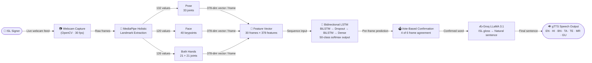

# 🤟 Real Time Indic Sign Language to Speech Translator

> Bridging the communication gap for the **Deaf and Hard-of-Hearing community** by translating **Indian Sign Language (ISL)** gestures into spoken sentences — in real time, across **7 Indian languages**, using just a webcam.


---

## 🌟 Overview

Indian Sign Language is the primary mode of communication for millions of Deaf and Hard-of-Hearing individuals across India, yet very few real-time tools exist to bridge the gap between ISL users and non-signers. This project addresses that gap.

The system works entirely through a **standard webcam** — no special hardware required. It captures live video, extracts skeletal and facial landmarks frame by frame using **MediaPipe Holistic**, and passes 30-frame sequences into a **Bidirectional LSTM** deep learning model to classify which ISL sign is being performed. Confirmed signs are assembled into a sentence, which is then grammatically refined using **Groq LLaMA 3.1** and spoken aloud via **Google Text-to-Speech** in the user's chosen Indian language.

---

## 🔄 System Architecture & Pipeline



---

## ✨ Key Features

| Feature | Description |
|---|---|
| 🎯 **50 ISL Word Classes** | Pronouns, family, professions, emotions, places, greetings, time |
| 🗣 **7 Indian Languages** | English, Hindi, Bengali, Tamil, Telugu, Marathi, Gujarati |
| ⚡ **Real-Time Recognition** | Server-side MediaPipe Holistic at up to 30 fps |
| 🧠 **Bidirectional LSTM** | Captures both forward and backward gesture motion |
| 🗳 **Vote-Based Stability** | 4/6 frame agreement required before confirming a word |
| ✍️ **AI Grammar Correction** | Groq LLaMA 3.1 converts ISL gloss into natural sentences |
| 🔄 **Rule-Based Fallback** | Works fully offline if Groq API is unavailable |
| 🌐 **Browser UI** | Live MJPEG camera stream, no plugins needed |
| 🔊 **Multilingual TTS** | Speaks final sentence in the user's chosen language |

---

## 🗂️ Project Structure

```
Real-Time-Indic-Sign-Language-to-Speech-Translator/
├── app.py                          # Flask backend — camera loop, inference, MJPEG stream
├── requirements.txt                # Python dependencies
├── .env.example                    # Environment variable template
├── Frontend/
│   ├── index.html                  # Main web UI (tricolor themed, India skyline)
│   ├── styles.css                  # Indian flag color palette styling
│   └── app.js                      # Camera control, status polling, UI updates
├── scripts/
│   ├── sentence_builder.py         # Standalone OpenCV desktop sentence builder
│   ├── word_tester.py              # Test all 50 signs with reference video panel
│   ├── personal_collector.py       # Record your own ISL training data via webcam
│   ├── data_collection.py          # Extract landmarks from raw dataset videos
│   ├── video_processor.py          # Video preprocessing utilities
│   ├── model_training.py           # Train BiLSTM on INCLUDE dataset features
│   ├── train_personal_only.py      # Train BiLSTM on personal recordings only
│   ├── augment_personal_data.py    # Augment recordings with noise/scaling
│   ├── fine_tune.py                # Fine-tune INCLUDE model on personal data
│   └── evaluation_report.py       # Per-class accuracy evaluation
├── models/
│   └── isl_model_solo.keras        # Active trained BiLSTM model (9.4 MB)
├── mediapipe_models/
│   ├── holistic_landmarker.task    # MediaPipe Holistic landmark model
│   └── *.tflite                    # Individual component models
├── data/
│   └── extracted_features/         # 50 label folders (class names)
└── reports/
    └── ISL_Dataset_Exploration_Report.pdf
```

---

## ⚙️ Installation

### Prerequisites

- Python 3.12
- A working webcam
- Windows / macOS / Linux

### 1. Clone the repository

```bash
git clone https://github.com/architinit/Real-Time-Indic-Sign-Language-to-Speech-Translator.git
cd Real-Time-Indic-Sign-Language-to-Speech-Translator
```

### 2. Create a virtual environment

```bash
python -m venv venv

# Windows
venv\Scripts\activate

# macOS / Linux
source venv/bin/activate
```

### 3. Install dependencies

```bash
pip install -r requirements.txt
```

### 4. Set up your Groq API key

```bash
cp .env.example .env
```

Open `.env` and fill in your key:
```
GROQ_API_KEY=your_groq_api_key_here
```

Get a free key at [console.groq.com](https://console.groq.com). The app works without it (falls back to rule-based grammar) but LLM correction gives better output.

---

## 🚀 Running the Project

### Option A — Web App (Recommended)

```bash
python app.py
```

Open **`http://localhost:5000`** in Chrome or Firefox.

1. Click **Start Camera** — webcam activates server-side
2. Perform an ISL sign in front of the camera
3. The detected word appears live in the **Detected Sign** panel
4. Words accumulate in the **Building Sentence** panel
5. Wait 2.5 seconds (auto-finalise) or click **Confirm**
6. Click **Speak** to hear it in your chosen language

> On the same WiFi network, other devices can access the app at `http://<your-local-IP>:5000`

### Option B — Desktop Script

A standalone OpenCV window — same pipeline, no browser needed.

```bash
python scripts/sentence_builder.py
```

| Key | Action |
|---|---|
| `ENTER` | Finalise sentence and speak |
| `B` | Undo last word |
| `C` | Clear sentence |
| `1–7` | Switch language (En/Hi/Bn/Ta/Te/Mr/Gu) |
| `Q` | Quit |

### Option C — Word Tester

Test all 50 signs one by one with a reference video side-by-side.

```bash
python scripts/word_tester.py
```

| Key | Action |
|---|---|
| `SPACE` | Mark sign as passed, move to next |
| `F` | Flag sign as failing, move to next |
| `Q` | Quit and print summary of flagged signs |

---

## 🧠 Training Your Own Model

The pre-trained model (`models/isl_model_solo.keras`) was trained on the project team's personal ISL recordings. Since sign language recognition is **signer-dependent** (hand size, signing style, and camera angle all affect accuracy), training on your own recordings will give better results.

```bash
# Step 1 — Record 30 sequences per word via webcam
python scripts/personal_collector.py

# Step 2 — Augment to expand the dataset
python scripts/augment_personal_data.py

# Step 3 — Train the BiLSTM
python scripts/train_personal_only.py
```

The new model is saved automatically to `models/isl_model_solo.keras`.

---

## 📊 Supported Signs — 50 Classes

| Category | Signs |
|---|---|
| **Pronouns** | I, You, He, She, They, We, It |
| **Family** | Mother, Father, Brother, Sister, Family, Friend |
| **Professions** | Teacher, Doctor, Police, Student, Man, Woman, Patient |
| **Emotions** | Happy, Sad, Good, Bad, Strong, Weak, Healthy, Sick, Alive |
| **Age** | Old, Young, Deaf |
| **Greetings** | Hello, How are you, Thank you, Good Morning |
| **Places** | House, Hospital, School |
| **Time** | Today, Tomorrow, Yesterday, Morning, Night, Time |
| **Others** | Exercise, Sign, Dream, Sport, Medicine |

---

## 📦 Dataset

The active model is trained entirely on **personally recorded ISL gesture data** — 30 sequences per word class, recorded via webcam and augmented to expand the dataset.

The **[INCLUDE dataset](https://zenodo.org/record/4010759)** (4,292 clips, 263 word signs, IIT Bombay) was used as a reference to select the 50 word classes covered by this project. It is not used for training and is not required to run the project.

---


## 🙏 Acknowledgements

- [INCLUDE Dataset](https://zenodo.org/record/4010759) — Indian Sign Language dataset by IIT Bombay
- [MediaPipe](https://mediapipe.dev) — Holistic landmark extraction by Google
- [Groq](https://groq.com) — LLaMA 3.1 ultra-fast inference for grammar correction
- [gTTS](https://gtts.readthedocs.io) — Google Text-to-Speech multilingual audio
- [TensorFlow / Keras](https://tensorflow.org) — Deep learning framework

---

## 📄 License

This project is licensed under the MIT License.
